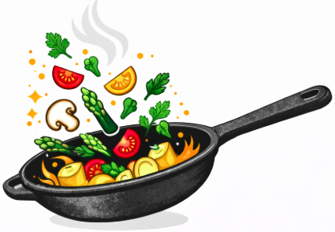

# Yummi 🍽️



Eine moderne **Rezept-App**, die dir hilft, passende Rezepte basierend auf deinen verfügbaren Zutaten zu finden.

## Features

- 🔍 **Intelligente Rezeptsuche** – Wähle deine Zutaten aus und finde sofort passende Rezepte
- ☁️ **Nextcloud-Synchronisation** – Deine Rezepte und Vorlieben sind überall verfügbar
- 🖼️ **Rezeptbilder** – Schöne Bilder für jedes Rezept
- 📝 **Rezepte erstellen & bearbeiten** – Neue Rezepte hinzufügen uber die Web-App
- 🔒 **Datenschutz** – Alle Daten bleiben auf deinem Nextcloud-Server
- 📱 **Progressive Web App** – Funktioniert offline und als installierte App
- ⚡ **Schnell & responsiv** – Optimiert für Mobile und Desktop

## Schnellstart

## Rezepte strukturieren

Rezepte werden als JSON-Dateien in deinem Nextcloud-Server unter `App-Ordner/recipes/` gespeichert:

```json
{
  "id": "pizza-margherita",
  "title": "Pizza Margherita",
  "description": "Klassische italienische Pizza",
  "category": "Hauptgerichte",
  "ingredients": [
    { "name": "Mehl", "amount": 500, "unit": "g" },
    { "name": "Tomaten", "amount": 400, "unit": "g" },
    { "name": "Mozzarella", "amount": 250, "unit": "g" }
  ],
  "steps": [
    { "title": "Teig zubereiten", "text": "Mehl mit Wasser mischen..." }
  ],
  "meta": {
    "prepMin": 30,
    "cookMin": 15,
    "servings": 4
  }
}